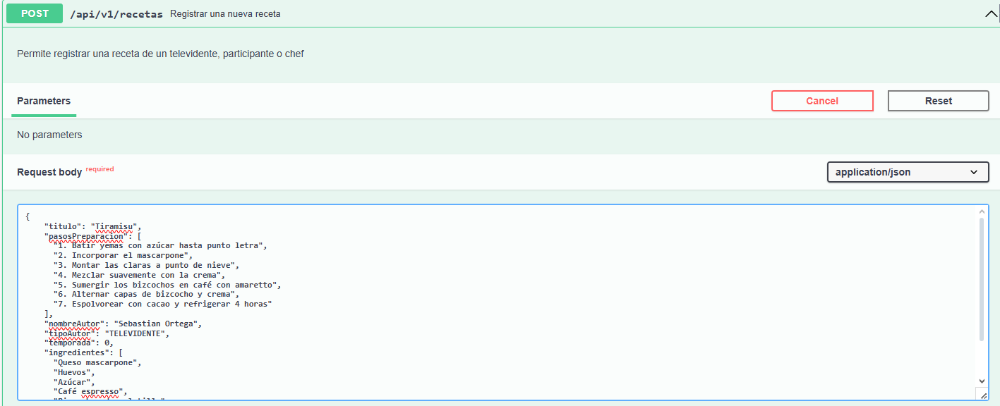
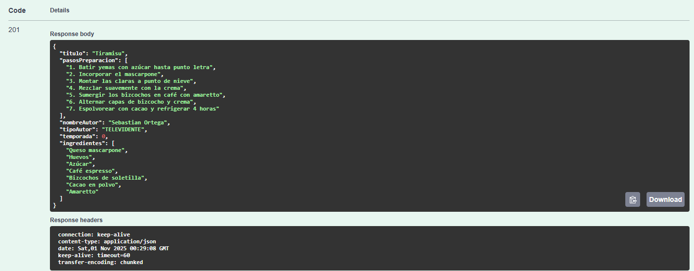
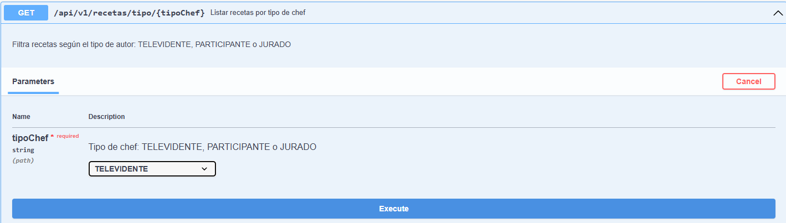
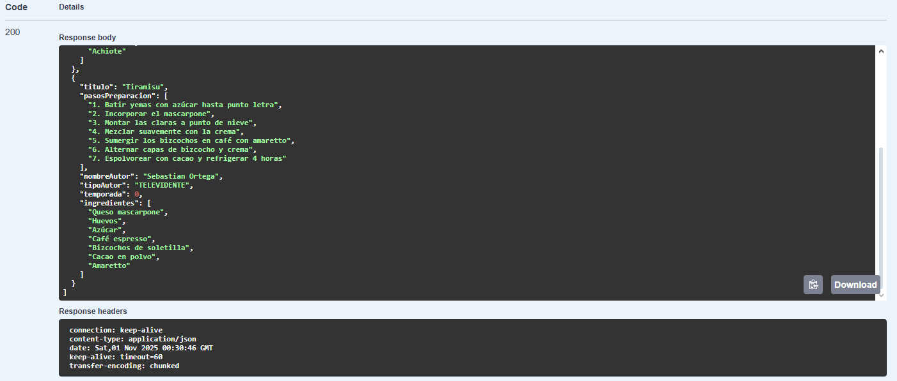
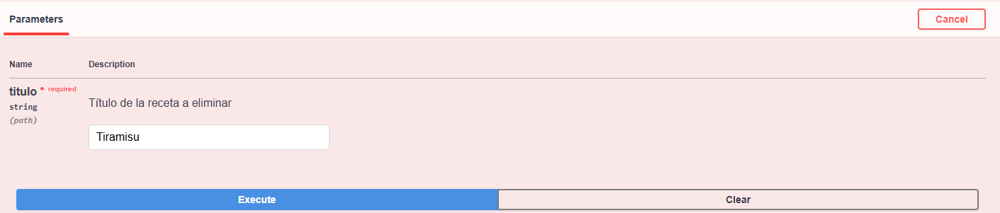
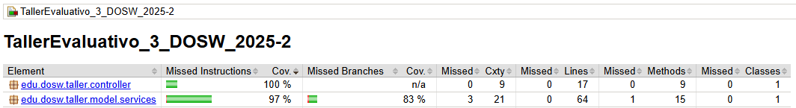
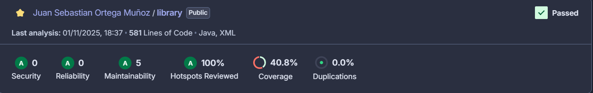

# TallerEvaluativo_3_DOSW_2025-2

### 👤Autor:
- Juan Sebastian Ortega Muñoz


## 📂 Nombre del repositorio
TallerEvaluativo_3_DOSW_2025-2

---

## 📋 Descripción
El objetivo de este proyecto es implementar una API de gestión de recetas de cocina para un reconocido programa de telerrealidad. La plataforma permitirá a los televidentes consultar, aprender y publicar recetas que han aparecido a lo largo de las temporadas, así como interactuar con recetas creadas por concursantes, chefs jurados y televidentes. La información se almacenará en MongoDB y se aplicarán buenas prácticas de desarrollo de software.

---

## 🎯 Objetivo del Taller
Desarrollar una API RESTful que permita la gestión y consulta de recetas de cocina, diferenciando el origen de cada receta (concursante, chef o televidente) y permitiendo búsquedas avanzadas, como filtrado por ingrediente o temporada. El sistema debe ser interactivo, seguro y fácil de usar, integrando herramientas modernas de desarrollo, pruebas y despliegue continuo.

---

## 📌 Requerimientos del cliente
- Permitir el registro de recetas por televidentes, participantes y chefs.
- Consultar todas las recetas o filtrarlas por tipo de autor (concursante, chef, televidente).
- Consultar recetas por temporada o por ingrediente específico.
- Consultar recetas por su número consecutivo.
- Permitir la actualización y eliminación de recetas.
- Persistir la información en MongoDB.
- Exponer la API con documentación Swagger.
- Implementar pruebas unitarias para registrar recetas, buscar por ingrediente y manejar errores de consulta.
- Configurar CI/CD con GitHub Actions y despliegue automático en Azure.

---

## 📌 Requerimientos funcionales
1. Registrar una receta de un televidente.
2. Registrar una receta de un participante (incluyendo la temporada).
3. Registrar una receta de un chef.
4. Listar todas las recetas guardadas.
5. Consultar una receta por su número consecutivo.
6. Listar recetas creadas por participantes.
7. Listar recetas creadas por televidentes.
8. Listar recetas creadas por chefs.
9. Listar recetas por temporada.
10. Buscar recetas que incluyan un ingrediente específico.
11. Eliminar una receta.
12. Actualizar una receta.
13. Persistir los datos en MongoDB.
14. Documentar la API con Swagger.
15. Incluir pruebas unitarias para los casos principales.
16. Configurar CI/CD con GitHub Actions y despliegue en Azure.
---

## ⚙️ Tecnologías a utilizar
- **Java OpenJDK** 17.x.x
- **Apache Maven** 3.9.x
- **JUnit** 5.x.x
- **Git** y cuenta de **GitHub**
- **Docker**
- **Jacoco**
- **SonarQube**
- **Spring Boot** 3.x.x
- **Lombok**
- **Swagger**
- **MongoDB** (base de datos NoSQL)
- **GitHub Actions** (CI/CD)
- **Azure** (Despliegue)

---

## 🏗️ Arquitectura (MVC)

El backend sigue la **arquitectura Modelo–Vista–Controlador (MVC)**. La estructura de carpetas se organizó para mantener separación de responsabilidades y buenas prácticas de ingeniería:


```
📁 src/main/java/edu/dosw/taller/
│
├── 📁 configs/               # ⚙️ Configuraciones globales (Swagger, seguridad, etc.)
├── 📁 controller/            # 🌐 Controladores REST (exposición de endpoints)
│   └── 📁 dtos/              # 📦 Data Transfer Objects (DTOs) para request/response
│   └── 📁 utils/             # 🛠️ Utilidades para el controlador (Excepciones, mapeos, etc.)
├── 📁 model/                 # 📊 Módulo de modelos y lógica base
│   ├── 📁 components/        # 🧩 Componentes adicionales (clases auxiliares)
│   │    └── 📁 utils/        # 🛠️ Utilidades para el modelo (mappers, validaciones, etc.)
│   ├── 📁 entities/          # 📝 Entidades de dominio (Task, User, etc.)
│   ├── 📁 persistence/       # 🗄️ Persistencia y acceso a datos
│   │   └── 📁 repository/    # 🔗 Interfaces con la BD (MongoDB Repositories)
│   └── 📁 services/          # 🔧 Servicios dentro de la capa de modelo


``` 

### 📋 Descripción de capas:

| **Capa**         | **Responsabilidad**                                        | **Tecnologías / Anotaciones** |
|------------------|------------------------------------------------------------|--------------------------------|
| **Controller**   | Manejo de peticiones HTTP y exposición de endpoints REST.  | Spring MVC, `@RestController` |
| **Model**        | Contiene el modelo de dominio y submódulos relacionados.   | Java classes, Lombok, DTOs |
| ├─ **Entities**  | Definición de entidades principales (Task, User, etc.).    | `@Document`, `@Entity` |
| ├─ **Components**| Clases auxiliares/componentes dentro del dominio.          | Beans, helpers de dominio |
| ├─ **Persistence/Repository** | Interfaces de acceso a datos y consultas CRUD. | MongoDB, Spring Data |
| └─ **Services**  | Servicios asociados al modelo (lógica de negocio puntual). | `@Service` |
| **Configs**      | Configuración global de la aplicación.                     | Swagger, Security, CORS |

---

## 📊 Diagramas del sistema

Para la documentación y análisis del proyecto se generaron los siguientes diagramas UML:

- ### **Diagrama de Componentes Especifico**
  

- ### **Diagrama de Clases**
  

---

## 😎 Swagger
### **Link del swagger**: http://localhost:8080/swagger-ui/index.html

---

### 🟡 POST:

Entrada:



Salida:



---

### 🟠 GET /tasks/search:

Entrada:



Salida:



---

### 🔴 DELETE

Entrada:



Proceso:


Salida:


---


---

## 🥥 JaCOCO



---

## 🐋 SonarQube

